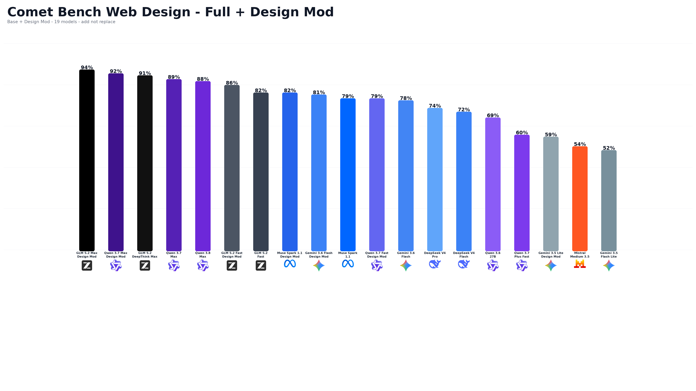

# 🔥 FireBall Design

**FireBall Design** is an advanced design skill for AI assistants.

Instead of generating generic, repetitive, "AI-looking" interfaces, FireBall Design teaches an AI how to think like a real designer. It adapts to the requested style, giving each project its own identity instead of forcing the same layout every time.

---



---

# Why FireBall Design?

Most AI assistants tend to generate websites that all feel alike:

- Similar layouts
- Similar spacing
- Similar animations
- Similar visual hierarchy
- Predictable design choices

FireBall Design removes this limitation.

Rather than following a single formula, it encourages the AI to understand the requested aesthetic and build a design that truly matches it.

The result feels handcrafted instead of AI-generated.

---

# What FireBall Design Changes

✅ Removes the "AI-generated" look

✅ Gives AI creative freedom

✅ Adapts to every design language

✅ Produces unique visual identities

✅ Encourages original layouts

✅ Better UI/UX consistency

✅ More professional results

---

# Compatible AI

FireBall Design can be used with nearly every modern AI assistant.

- ChatGPT
- Claude
- Gemini
- Mistral
- DeepSeek
- Qwen
- Grok
- Codex
- and many more...

---

# Installation

## ChatGPT

If Skills are supported:

1. Create a new Skill.
2. Upload `skill.md`.
3. Enable it.
4. Start creating.

If Skills are **not** supported:

1. Upload the `skill.md` file in the conversation.
2. At the end of your request, simply write:

> **Use the attached `skill.md`.**

If your AI has reached the file upload limit:

1. Upload the `skill.md` somewhere accessible.
2. Share the link.
3. End your prompt with:

> **Use this skill.md: https://your-link-here**

---

## Claude

Create a new Skill and paste or upload the contents of `skill.md`.

Done.

---

## Mistral Vibe

Create a new Skill.

Paste or upload `skill.md`.

Done.

---

# Philosophy

FireBall Design is not a UI library.

It is not a CSS framework.

It is not a prompt collection.

It is a **design mindset**.

The AI learns how to reason visually instead of copying the same structure over and over.

Every project should feel intentional.

Every interface should have its own personality.

---

# Example

Instead of asking:

> Create a landing page.

You can ask:

> Create a futuristic landing page for an AI operating system.
>
> **Use the attached `skill.md`.**

The AI will adapt its design language instead of reusing common AI-generated layouts.

---

# FireBall Team

Developed by the **FireBall Team**.

Designed for creators who want AI-generated interfaces to feel genuinely designed—not generated.

---

© FireBall Team
```
